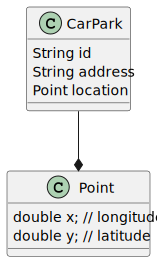
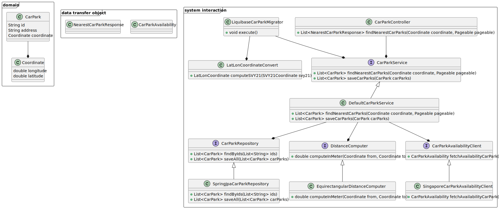

# Car Park - Analysis

## Requirements

* The system should provide an API to find the nearest car parks based on the given coordinate.

## Design

### System Operations

- Query operation:
  - findNearestCarParks() 
      - The operation takes `longitude` & `latitude` as a central coordinate and returns the nearest available car parking.
      - The result of operation must be sorted by distance ascending and paginated.
      - The operation must return error when the input is invalid.
        - when longitude or latitude is missing
        - when pagination input is invalid.
        - when page is less than 1

### Domain Model

- CarPark: The model that contains car parking information. 

Since this is very basic application, [transcription script pattern](https://martinfowler.com/eaaCatalog/transactionScript.html) should be applied when we contain most business logic in service layer.

>**NOTE**: There are more fields from csv file datasource, but here we only model fields that are needed for the system.

### System

Here we follow the basic [Hexagonal architecture](https://en.wikipedia.org/wiki/Hexagonal_architecture_(software)) to design the system.

- System:
  - Inbound adapter:
    - `CarParkController`: Serve `findNearestCarParks()` operation as REST endpoint.
  - Domain business logic:
    - `CarParkService`: Where all system operations are implemented.
    - `CarParkQueryService`: Abstraction for querying avaialable car parks.
    - `CarParkRepository`: Abstraction for car parks persistence .
  - Outbound adapter:
    - `PostgisCarParkRepository`: The postgis database repository implementation for `CarParkRepository`
    - `SingaporeCarParkAvailabilityClient`: The `CarParkQueryService` client implementation that queries data from Singapore government data source. 
- Migration:
  - `LiquibaseCarParkMigrator`: A liquibase custom change set that imports data from csv file to database.
  - `LatLogCoordinate`: A converter that supports convert SVY21 format to lon/lat system.

>**NOTE**: The converting from SVY21 to lat/long coordinate algorithm could be found [here](https://github.com/cgcai/SVY21).
> Since this library is not published on maven artifactory and the source code has only few classes, we will copy
> the whole library source code to our application.
> Please check this [folder](../src/main/java/com/wego/interview/carpark/migration/svy21_copied) to see the source code.

### Outbound Adapter

#### Persistence Adapter: `PostgisCarParkRepository`

Since domain model `CarPark` contains geospatial  data. It's reasonable to pick the DBMS that supports storing, indexing, and querying geospatial data.

In this application, we will use Postgres database with [Postgis](https://postgis.net/) extension.

For our business case, to find out the nearest car parks with a specific coordinate as input. We will apply the [Nearest-Neighbour Searching](https://postgis.net/workshops/postgis-intro/knn.html) computation that Postgis supports out of the box.

The idea is simple: `Given a coordinate then compute all distances between this coordinate and other stored locations in database then sort it by ascending order.`

#### Client Adapter: `SingaporeCarParkAvailabilityClient`

Since the operation `findNearestCarParks()` serves real-time data for customer, and it also queries a large volume of data from external source, this could be a bottleneck of the application when it comes to performance topic.

**Cache `SingaporeCarParkAvailabilityClient#findAvailableCarParks()` query.**

This is a query, data consistency would not be a problem here. It's reasonable to cache this query.

Base on the recommendation from the [car parks availability datasource](https://beta.data.gov.sg/collections/85/view) website,
`1 minute` cache expiration would be a good setting.