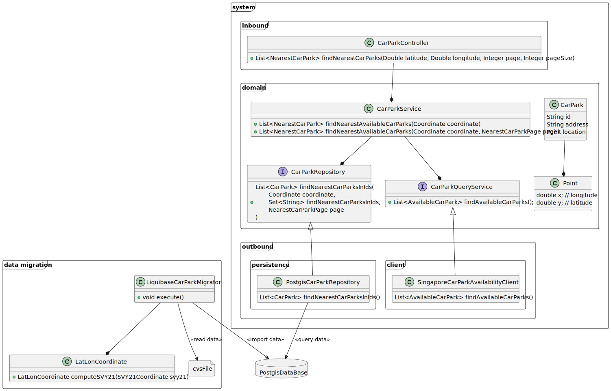

# Car Park - Analysis

## Requirements

* For requirements, please read the [pdf](Senior%20Software%20Engineer%20Coding%20Exercise.pdf)

## Design

### System Operations

- Query operation:
  - findNearestCarParks() 
      - The operation takes `longitude` & `latitude` as a central coordinate and returns the nearest available car parking.
      - The result of operation must be sorted by distance ascending and paginated.
      - The operation must return error when the input is invalid.
- Command operation:
  - saveCarParks()
    - The operation takes car park information and save it into database.

### Domain Model

- CarPark: The model that contains car parking information. 

Since this is very basic application, [transcription script pattern](https://martinfowler.com/eaaCatalog/transactionScript.html) should be applied when we contain most business logic in service layer.

>**NOTE**: There are more fields from datasource, but here we only model fields that needed for the system.

### System

Here we follow the basic [Hexagonal architecture](https://en.wikipedia.org/wiki/Hexagonal_architecture_(software)) to design the system.

- Inbound adapter:
  - `LiquibaseCarParkMigrator`: In charge of migrating car park information from cvs file to database.
    - `LatLonCoordinateConverter`: Convert SVY21 coordinate format to lat/long coordinate system.
  - `CarParkController`: Serve `findNearestCarParks()` operation as REST endpoint.
- Business logic:
  - `CarParkService`: Where all system operation is implemented.
  - `DistanceComputer`: Abstraction for compute distance between 2 coordinate.
  - `CarParkAvailabilityClient`: Abstraction for querying car parks availability;
  - `CarParkRepository`: Abstraction for car parks persistence 
- Outbound adapter:
  - `SpringJpaCarParkRepository`: a DAO implementation provided by Spring JPA.
  - `EquirectangularDistanceComputer`: Distance computation based on Equirectangular Distance Approximation formula.
  - `SingaporeCarParkAvailiabilityClient`: Client that queries data from Singapore government data source. 

>**NOTE**: The converting from SVY21 to lat/long coordinate algorithm could be found [here](https://github.com/cgcai/SVY21).
> Since this library is not published on maven artifactory and the source code has only few classes, we will copy
> the whole library source code to our application.

### Performance 

Since the operation `findNearestCarParks()` serves real-time data for customer, and it also queries a large volume of data from external source, this could be a bottleneck of the application when it comes to performance topic.

**Cache `findNearestCarParks()` operation.**

This is a query operation, data consistency would not be the problem here. It's reasonable to cache this operation.

Based on the recommendation from the [car parks avalibity datasource](https://beta.data.gov.sg/collections/85/view) website, `1 minues` cache expiration would be a good setting.

**Algorithm & Data Structure for `findNearestCarParks()` operation**

The size of computed source for car park availability would be approximately `300000` records.
This is not really a big number for a single instance application to compute the distance of a specific coordinate against `300000` **in parallel** then do the sorting to find the nearest records.

Specially data structure or algorithm could be overkilled in this situation.

See this discussion for more details: https://gis.stackexchange.com/questions/4846/algorithm-to-find-nearest-point

**Distance computation algorithm**

There are various algorithm that supports us to calculate the distance between two geographical coordinates:

| Formula                                    | Pros                                             | Cons                                                                       |
|--------------------------------------------|--------------------------------------------------|----------------------------------------------------------------------------|
| **Equirectangular Distance Approximation** | Very very fast                                   | Not very accurate when calculating long distance                           |
| **Haversine Formula**                      | Fast and accurate when calculating long distance |                                                                            |
| **Vincenty’s Formula**                     | Very accurate when calculating long distance     | Compute-heavy formula, very slow compared to other formula mentioned above |

Based on the business requirements, all car parks are located in Singapore. There would be no need for long distance computation, beside this is real-time computation (every minute),
performance should be the first thing to prioritize when selecting computation formula.

See this article for more details: https://www.baeldung.com/java-find-distance-between-points

=> We will use `Equirectangular Distance Approximation` formula in the application, since it now fits the business requirements.